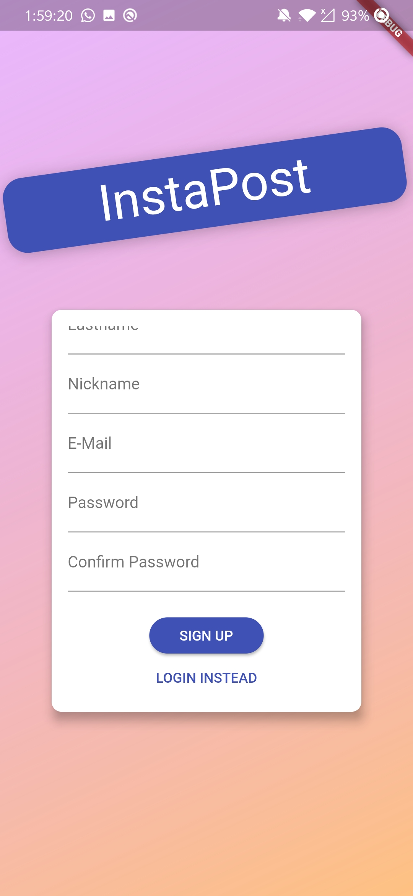
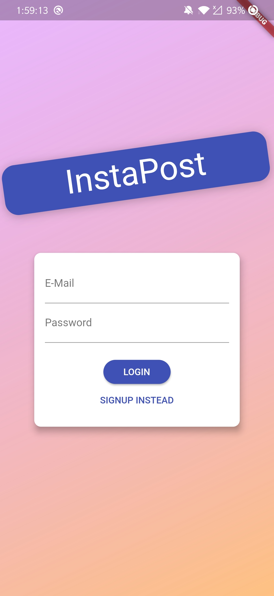
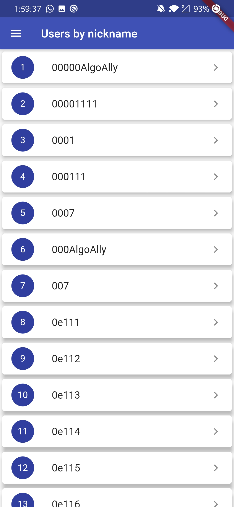
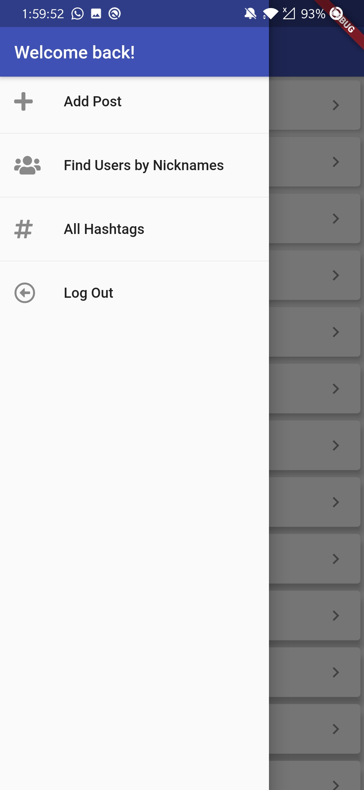
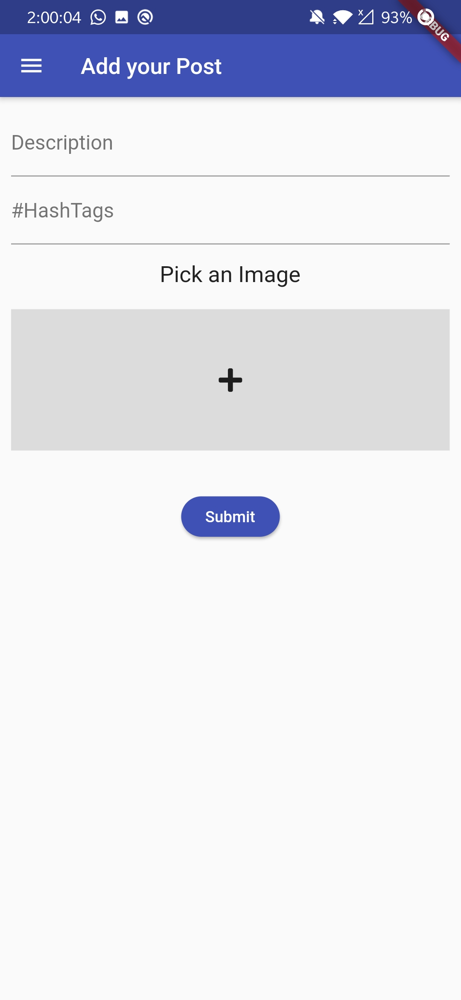
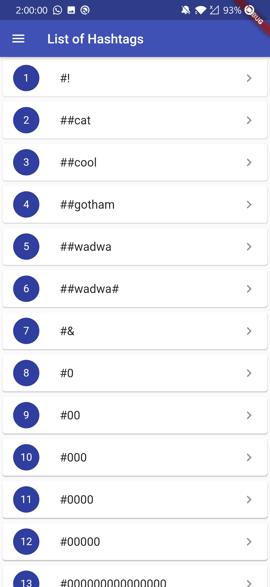
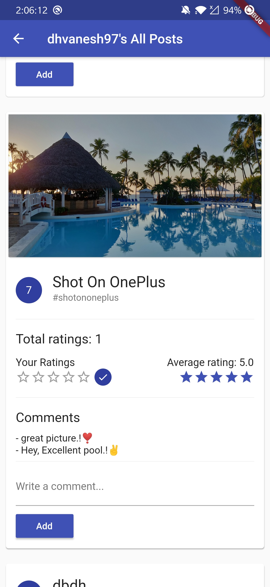
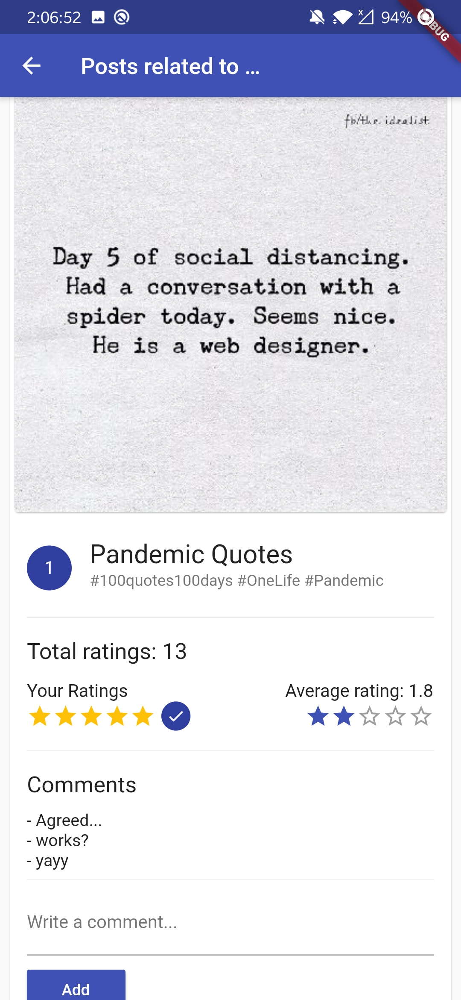

# InstaPost

<table>
<tr>
<td>
<strong>A minified version of Instagram where users can submit their posts, rate as well as comment on other users's posts. Users can even find other users by their nickname and see all posts related to particular hashtag.
</strong>
</td>
</tr>
</table>

## Requirements

- Flutter
- Either VS Code or Android Studio
- Both editors require Flutter & dart plugins installation

## Features

* Saves user information with Shared preferences
* Auto-Login
* User can add post with text and an image
* User can rate and comment on other users's posts
* Find other users by their nicknames
* Find all posts related to particular hashtag
* User friendly design
* App provides all necessary validations in case of any unexpected error

## Setup

- clone the repo and run app on your plugged phone/Android Emulator

## Screenshots

<table>
  <tr>
    <td>Signup</td>
    <td>Login</td>
    <td>All Users by nickanme</td>
  </tr>
  <tr>
    <td valign="top"></td>
    <td valing="top"></td>
    <td valing="top"></td>
  </tr>
  <tr>
    <td>Menu</td>
    <td>Add Post Screen</td>
    <td>All hashtags</td>
  </tr>
  <tr>
    <td valign="top"></td>
    <td valign="top"></td>
    <td valign="top"></td>
  </tr>
  <tr>
    <td>Post of a user with nickname <strong>dhvanesh97</strong></td>
    <td>Post related to selected hashtag</td>
  </tr>
  <tr>
    <td valign="top"></td>
    <td valign="top"></td>
  </tr>
 </table>

## Getting Started

This project is a starting point for a Flutter application.

A few resources to get you started if this is your first Flutter project:

* [Lab: Write your first Flutter app](https://flutter.dev/docs/get-started/codelab)
* [Cookbook: Useful Flutter samples](https://flutter.dev/docs/cookbook)

For help getting started with Flutter, view our
[online documentation](https://flutter.dev/docs), which offers tutorials, 
samples, guidance on mobile development, and a full API reference.
